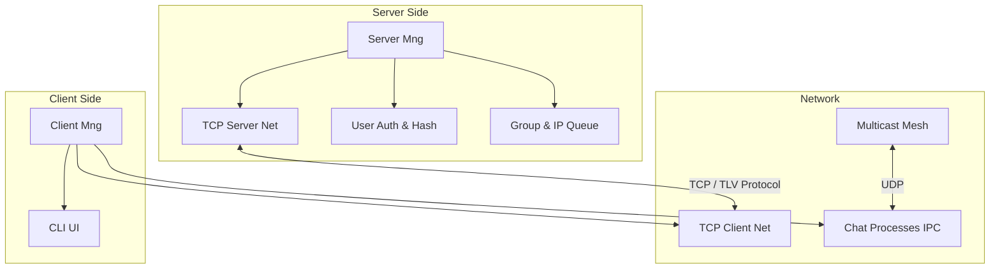

# Real-Time Embedded Mesh Chat 🚀


A deterministic, real-time LAN messaging system built in C. This project features a centralized TCP management server and a decentralized UDP Multicast mesh for peer-to-peer chat communication. It is designed with strict embedded systems constraints, avoiding dynamic memory allocation at runtime.

---

## 🏗️ System Architecture

The system is divided into a Management Server and multiple Clients, utilizing a custom TLV (Tag, Length, Value) protocol for state management and UDP Multicast for actual chat message delivery.



## ✨ Key Features

* **TCP Centralized Management:** Handles user registration, authentication, and dynamic allocation of Multicast IPs/Ports using a pre-allocated queue.
* **UDP Multicast Mesh:** Chat messages are sent directly peer-to-peer over the LAN, completely bypassing the management server for zero-latency communication.
* **Deterministic Memory:** Strictly avoids runtime `malloc`/`free`. Uses static memory pools and a pre-compiled shared library (`.so`) for data structures (Hash Maps, Queues).
* **Multi-Process Architecture:** Clients dynamically spawn separate `gnome-terminal` windows for sending and receiving messages.
* **IPC (Inter-Process Communication):** Spawned processes report their PIDs back to the main client via Message Queues, allowing graceful remote teardown using `kill()` upon leaving a group.

---

## 🛠️ Getting Started

### Prerequisites
* Linux environment (Ubuntu / WSL)
* GCC compiler
* CMake (v3.20 or higher)
* `gnome-terminal` (for UI multi-processing)

### Build Instructions

The project uses CMake for building and incorporates `CMAKE_BUILD_RPATH` to seamlessly link the dynamic data structures library without needing to manually configure `LD_LIBRARY_PATH`.

```bash
# Clone the repository
git clone [https://github.com/sagi-stav/rt-embedded-mesh-chat.git](https://github.com/sagi-stav/rt-embedded-mesh-chat.git)
cd rt-embedded-mesh-chat

# Create build directory and compile
mkdir build && cd build
cmake ..
make
```

---

## 💻 Usage

After a successful build, the executables will be generated. You need to run the server first, followed by one or more clients.

**1. Start the Server:**
```bash
./server_app
```

**2. Start a Client:**
```bash
./client_app
```

**Client Navigation:**
* **Screen 1 (Auth):** Register a unique username/password, or Login with existing credentials.
* **Screen 2 (Chat Rooms):** Create a new group (assigns a fresh IP from the server's pool), Join an existing group, or Leave. Joining a group automatically spawns the UDP sender and receiver terminals.

---

## 📂 Directory Structure

```text
chat_project/
├── CMakeLists.txt              # CMake configuration with RPATH
├── include/                    # Shared API Headers
│   ├── limits.h                # Hardcoded system limits (MAX_USERS, etc.)
│   ├── protocol.h              # TLV struct definitions
│   └── data_structures.h       # Shared data structures API
├── lib/                        # Pre-compiled Libraries
│   └── libdata_structures.so   # Dynamic library for Hash Maps & Queues
└── src/                        # Source Code
    ├── server_*.c              # TCP Server logic
    ├── client_*.c              # TCP Client & UI logic
    ├── sender.c                # UDP Multicast sender app
    ├── receiver.c              # UDP Multicast receiver app
    └── protocol.c              # TLV serialization logic
```

---

## 👨‍💻 Authors

* **Sagi Stav** * **[Your Partner's Name]** Designed and developed as part of an advanced Data Communication and Network Programming curriculum.
